# Messenger Clone 📱

A **Flutter** project focused on building a **Messenger App clone**.  
This project contains the **user interface screens only**, without full backend or real-time functionalities.

---

## 📂 Project Structure

```
messenger_clone/
├── lib/
│   ├── extensions/
│   │   └── app_exten.dart
│   ├── views/
│   │   ├── auth/
│   │   │   ├── login_screen.dart
│   │   │   └── otp/
│   │   │       └── otp_screen.dart
│   │   ├── chats/
│   │   │   ├── chat_screen.dart
│   │   │   └── more/
│   │   │       └── more_screen.dart
│   │   ├── constant/
│   │   │   ├── app_colors.dart
│   │   │   └── app_themes.dart
│   │   ├── cubit/
│   │   │   └── theme_cubit.dart
│   │   ├── nav/
│   │   │   ├── bottom_screen.dart
│   │   │   └── contacts_screen.dart
│   │   ├── profile/
│   │   │   └── profile_screen.dart
│   │   ├── startup/
│   │   │   └── onboarding.dart
│   │   └── widgets/
│   │       └── ui_helper.dart
│   └── main.dart
├── screenshots/
│   ├── flutter_01.png
│   ├── flutter_02.png
│   ├── ...
│   └── flutter_14.png
├── pubspec.yaml
└── README.md
```

---

## ✨ Features

- Beautiful login, OTP, and onboarding screens
- Messenger-style chat UI
- Profile and contacts UI
- Light/Dark mode UI with theme switching
- Modular and scalable folder structure

---

## 🖼️ App UI Screenshots

<p align="center">
  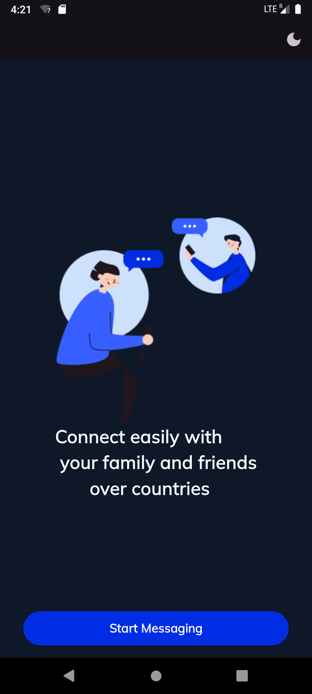
  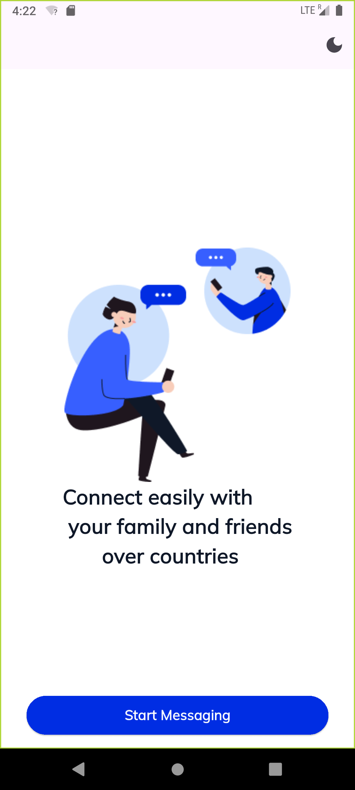
  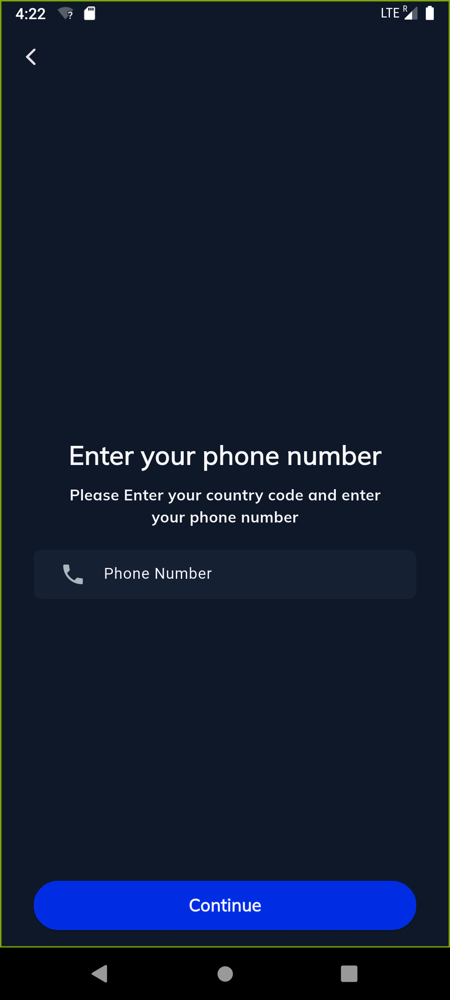
  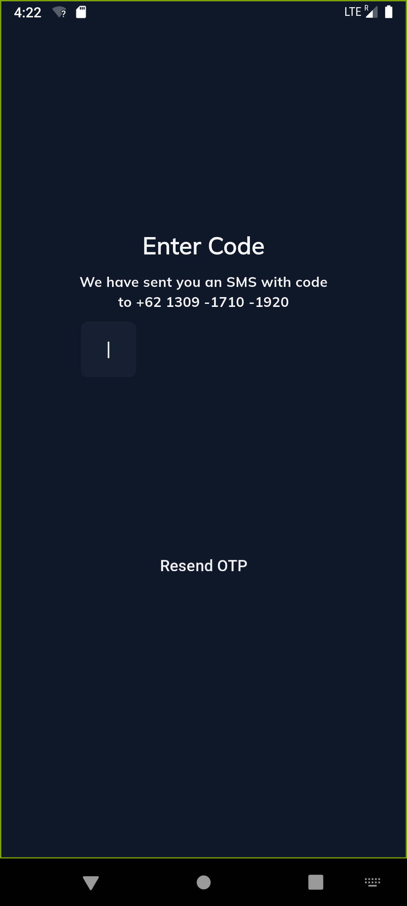
  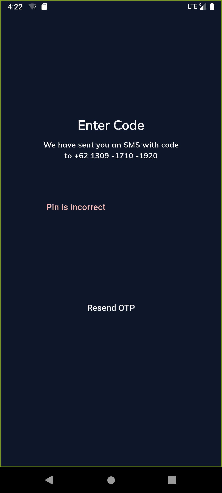
</p>
<p align="center">
  
  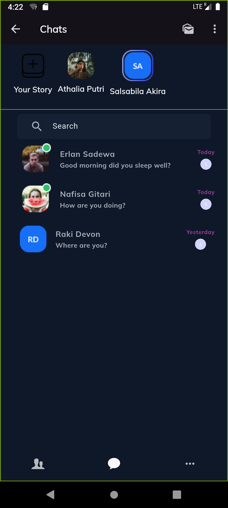
  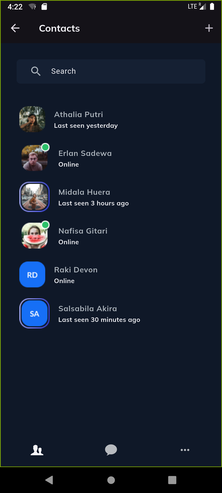
  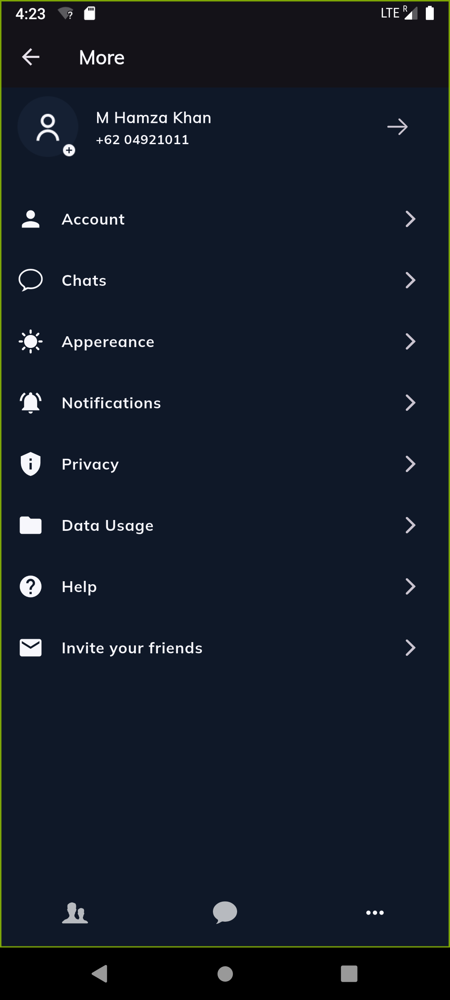
  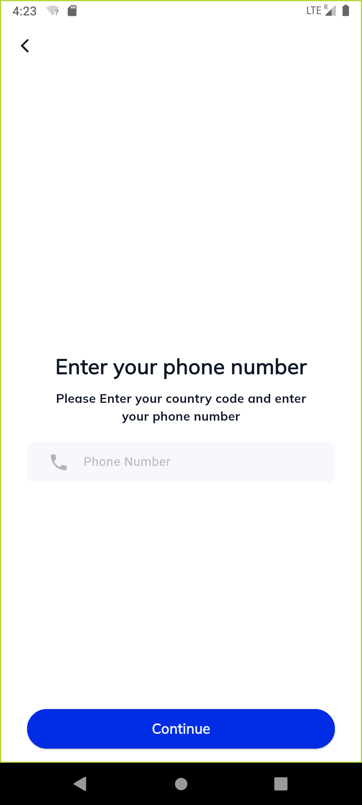
</p>
<p align="center">
  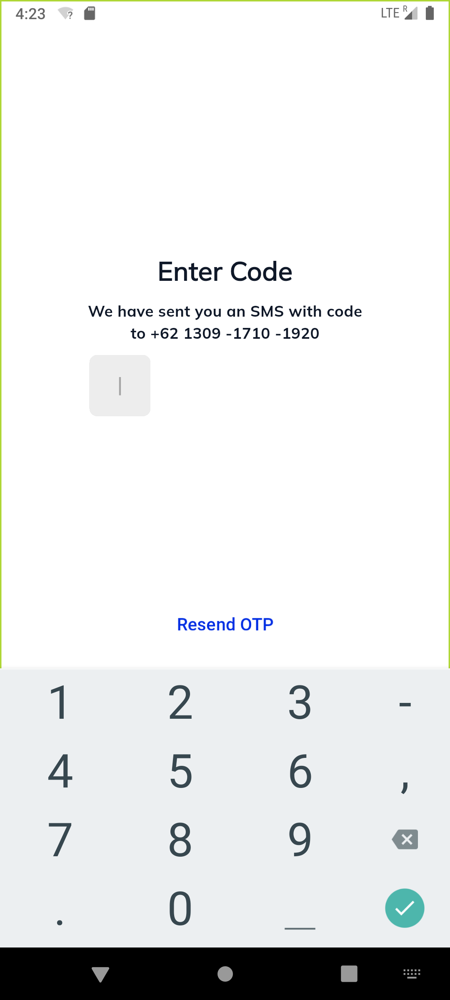
  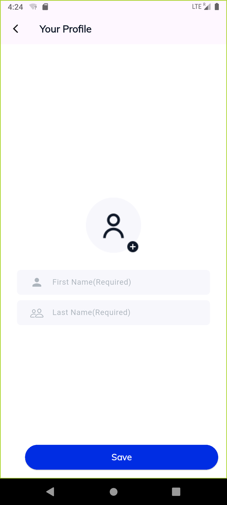
  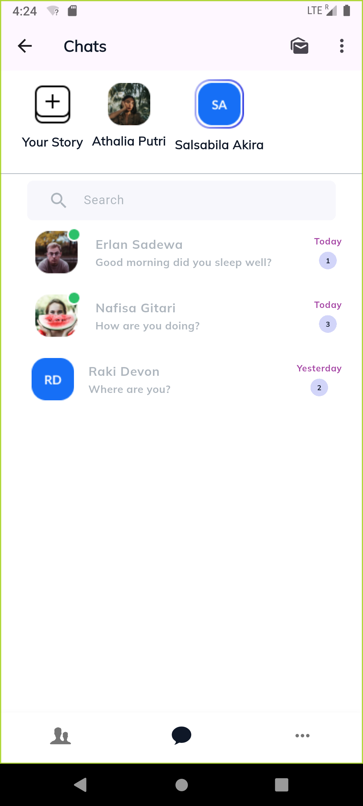
  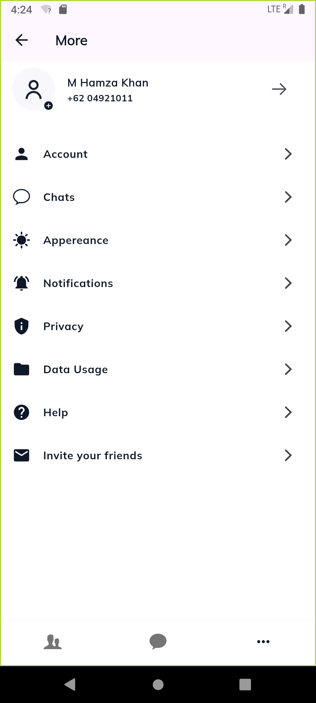
</p>

---

## 🚀 Getting Started

### Prerequisites

- Flutter installed ([Install Flutter](https://docs.flutter.dev/get-started/install))
- Any Flutter-supported IDE (VS Code, Android Studio)

### How to Run

```bash
git clone https://github.com/your-username/messenger_clone.git
cd messenger_clone
flutter pub get
flutter run
```

---

## 🛠️ Built With

- [Flutter](https://flutter.dev/) - Frontend framework
- [Dart](https://dart.dev/) - Programming Language

---

## 📜 License

This project is open source and available under the [MIT License](LICENSE).

